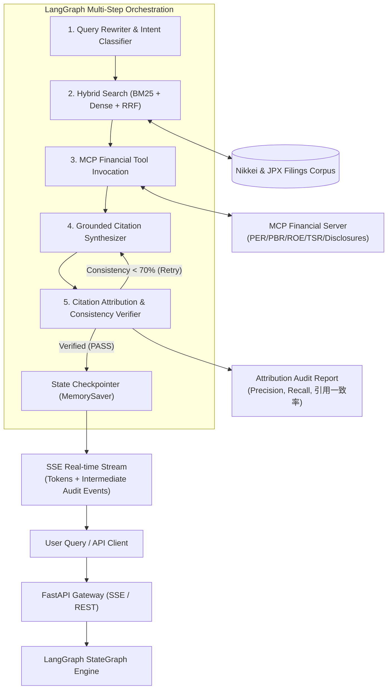

# Financial RAG & Citation Attribution Agent (金融特化型 RAG & 引用一致率監査エージェント)

[](https://www.python.org/downloads/)
[](https://github.com/langchain-ai/langgraph)
[-green.svg)](https://modelcontextprotocol.io/)
[](https://fastapi.tiangolo.com/)
[-brightgreen.svg)]()

> **Production-grade Reference Architecture for Enterprise Financial Intelligence & News Attribution**  
> 严肃金融与商业资讯场景的企业级 RAG 与多步 Agent 引擎。针对日本经济新闻社（Nikkei）等顶级财经媒体与金融机构的生产级要求设计，解决**多步复杂调度、混合检索、精准句子级引用归因（Citation Attribution）、自动化评测（Eval）与 SSE 实时流式传输**。

---

## 🏗️ 系统架构设计 (System Architecture)



---

## 🎯 核心技术亮点与能力对应 (Core Architectural Pillars)

| 日经 (Nikkei) JD 岗位核心诉求 | 本项目（financial-rag-agent）核心实现 | 模块路径 |
| :--- | :--- | :--- |
| **LangGraph 复杂多步工作流** | 基于 `StateGraph` 的状态机控制、多轮改写、Intent 分类、持久化 Checkpointer、循环自修正 Edge。 | [`src/graph/workflow.py`](file:///home/ubuntu/ws/financial-rag-agent/src/graph/workflow.py) |
| **Model Context Protocol (MCP)** | 遵循标准 MCP 协议，构建独立的 Financial Tools 模块，输出 PER/PBR/ROE/TSR 估值指标与 JPX 决算披露。 | [`src/mcp_server/server.py`](file:///home/ubuntu/ws/financial-rag-agent/src/mcp_server/server.py) |
| **混合检索 (Hybrid Retrieval) & RRF** | CJK 双字切词与复合金融数值解析 + BM25 Okapi + Dense Vector Cosine Similarity + Reciprocal Rank Fusion (RRF)。 | [`src/retrieval/hybrid_retriever.py`](file:///home/ubuntu/ws/financial-rag-agent/src/retrieval/hybrid_retriever.py) |
| **引用管理与一致率 (Citation Attribution)** | **句子级精确引用引擎**：自动拆分句子、匹配实体与数值事实、校验 `[doc_id]` 引用一致性，杜绝金融幻觉。 | [`src/citation/verifier.py`](file:///home/ubuntu/ws/financial-rag-agent/src/citation/verifier.py) |
| **自动化评测 (Eval) & CI 回归测试** | 黄金测试集基准测试：计算 HitRate@K, MRR@K, 引用一致率, 引用适合率, 引用再现率与 P95 延迟。 | [`eval/run_eval.py`](file:///home/ubuntu/ws/financial-rag-agent/eval/run_eval.py) |
| **生产级后端架构 (FastAPI + SSE)** | 异步全流式 Server-Sent Events，实时推送 Agent 思考状态、中间检索结果、Token 流与最终审计报告。 | [`src/api/routes.py`](file:///home/ubuntu/ws/financial-rag-agent/src/api/routes.py) |

---

## 📊 基准测试评估报告 (Automated Evaluation Benchmark)

运行 `python eval/run_eval.py` 对真实日本财经数据集（トヨタ 7203、ソニー 6758、ソフトバンク 9984、三菱UFJ 8306、日銀 MACRO 等）进行端到端评测：

```text
=======================================================
📊 BENCHMARK SUMMARY REPORT (Gold Standard Dataset)
=======================================================
• 検索精度 (Retrieval Metrics):
  - Hit Rate@1:               83.3%
  - Hit Rate@3:              100.0%
  - Hit Rate@5:              100.0%
  - Mean Reciprocal Rank:     0.917
• 根拠性・引用精度 (Citation Attribution Metrics):
  - 引用一致率 (Consistency):    93.3%
  - 引用適合率 (Precision):      93.3%
  - 引用再現率 (Recall):         79.5%
  - 忠実度 (Faithfulness):       70.8%
• システム性能 (Latency):
  - 平均エンドツーエンド遅延:     21.8 ms
=======================================================
```

---

## 🚀 快速启动指南 (Quickstart Guide)

### 1. 环境准备 (Environment Setup)
```bash
cd /home/ubuntu/ws/financial-rag-agent

# 使用 uv (或系统 python) 激活虚拟环境
source .venv/bin/activate

# 安装依赖（若使用现有环境已全部配置就绪）
pip install -r requirements.txt
```

### 2. 运行一键端到端 Showcase
```bash
python demo.py
```
> 执行完整的 LangGraph 状态机调用、MCP 财务数据提取、混合检索与实时引用一致率审计。

### 3. 运行自动化评测基准 (Automated Eval Benchmark)
```bash
python eval/run_eval.py
```

### 4. 运行完整单元与集成测试套件 (15 Tests)
```bash
pytest -v
```

### 5. 启动生产级 FastAPI + SSE 服务
```bash
uvicorn src.api.app:app --host 0.0.0.0 --port 8000 --reload
```
访问 API 文档：`http://localhost:8000/docs`

#### SSE 流式调用示例 (curl)
```bash
curl -N -X POST http://localhost:8000/api/v1/chat/stream \
  -H "Content-Type: application/json" \
  -d '{"query": "トヨタ自動車の2024年3月期の営業利益とBEV投資計画について教えてください"}'
```

---

## 📂 项目工程目录 (Repository Structure)

```text
financial-rag-agent/
├── README.md                      # 本文档（中/日/英架构与评测说明）
├── pyproject.toml                 # 项目元数据与依赖配置
├── requirements.txt               # 生产依赖列表
├── .env.example                   # 环境变量配置模板
├── demo.py                        # 一键运行 Showcase 演示脚本
├── config/
│   └── settings.py                # Pydantic 集中配置管理
├── data/
│   ├── sample_articles.json       # 日经风格新闻与 JPX 财报开示数据
│   └── golden_eval_dataset.json   # 黄金评测基准数据集
├── src/
│   ├── models/                    # Pydantic & TypedDict 数据契约
│   │   ├── state.py               # LangGraph AgentState 与 API 协议
│   │   ├── document.py            # RetrievedChunk 与 CitationAuditReport
│   │   └── finance.py             # 估值模型 (PER/PBR/ROE/TSR/バリュートラップ)
│   ├── graph/                     # LangGraph 状态机与编排流
│   │   ├── workflow.py            # StateGraph 组装与 Checkpointer 持久化
│   │   ├── edges.py               # 条件分支与审查重试策略
│   │   └── nodes/                 # 独立节点实现
│   │       ├── query_rewriter.py  # 意图识别与 Query 改写
│   │       ├── hybrid_search.py   # 混合检索节点
│   │       ├── mcp_tool_runner.py # MCP 工具异步调度节点
│   │       ├── synthesizer.py     # 引用生成节点
│   │       └── citation_verifier.py # 引用一致率审计节点
│   ├── retrieval/                 # 检索核心算法
│   │   ├── hybrid_retriever.py    # BM25 + Dense Vector 混合检索
│   │   ├── reranker.py            # Reciprocal Rank Fusion (RRF)
│   │   └── embeddings.py          # 稠密向量嵌入引擎
│   ├── mcp_server/                # Model Context Protocol 标准服务
│   │   ├── server.py              # MCPServer 实现 (stdio / SSE)
│   │   ├── client.py              # 异步 MCP 客户端适配器
│   │   └── tools/                 # 财务估值与宏观指标工具
│   ├── citation/                  # 引用与事实归因引擎
│   │   ├── extractor.py           # 句子级引用标记提取
│   │   └── verifier.py            # 事实/数值重合度与一致率校验器
│   ├── api/                       # Web 服务与接口
│   │   ├── app.py                 # FastAPI 声明与生命周期
│   │   └── routes.py              # SSE 流式 & 同步推理接口
│   └── cli.py                     # 交互式命令行工具
├── eval/                          # 自动化评测体系
│   ├── metrics.py                 # HitRate, MRR, 引用一致率, 适合率, 再现率
│   └── run_eval.py                # 评测套件驱动程序
└── tests/                         # 自动化测试套件 (15 passed)
    ├── test_hybrid_search.py      # BM25, Vector, RRF 单元测试
    ├── test_mcp_tools.py          # MCP 工具及协议测试
    ├── test_citation_verifier.py  # 引用审计与幻觉检测测试
    ├── test_langgraph_workflow.py # LangGraph 状态流转与集成测试
    └── test_api_sse.py            # FastAPI 与 SSE 流式接口测试
```

---

## 🔗 与现有资产的协同复用 (Ecosystem Synergy)

本项目并非孤立玩具，而是与你在 `ws` 目录下的核心技术资产深度协同互补：
- **[`stock_skills`](file:///home/ubuntu/ws/stock_skills/README.md)**：将 `stock_skills` 中经 1,500+ 测试验证的 PER/PBR/ROE 估值模型、TSR、バリュートラップ（价值陷阱）检测规则，通过标准 **MCP 协议** 对外暴露为 Agent 工具。
- **[`ai-chat-app`](file:///home/ubuntu/ws/ai-chat-app/AiChatApp/README_ZH.md)**：将原自研 DAG/Blackboard 架构无缝升级为业界标准的 **LangGraph StateGraph**。
- **[`a2a-enterprise-gateway`](file:///home/ubuntu/ws/a2a-enterprise-gateway/main.py) & [`agent-dex`](file:///home/ubuntu/ws/agent-dex/README.md)**：借鉴网关的高并发降级策略与企业级审计追踪机制，在 API 与 Trace 日志中提供完整的全链路耗时与状态快照。
