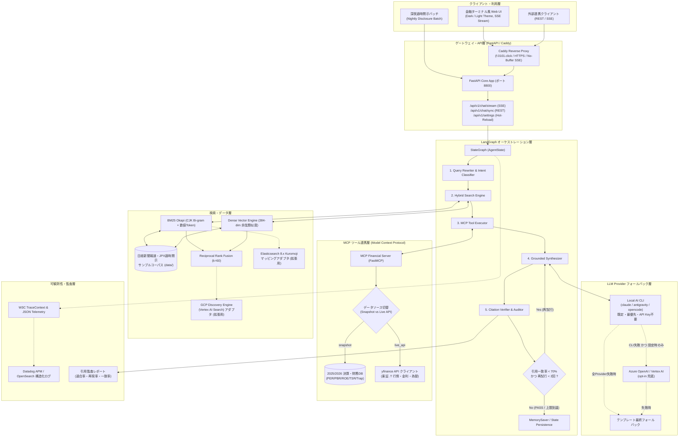
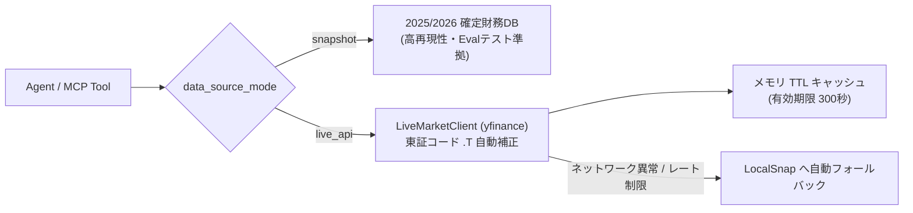
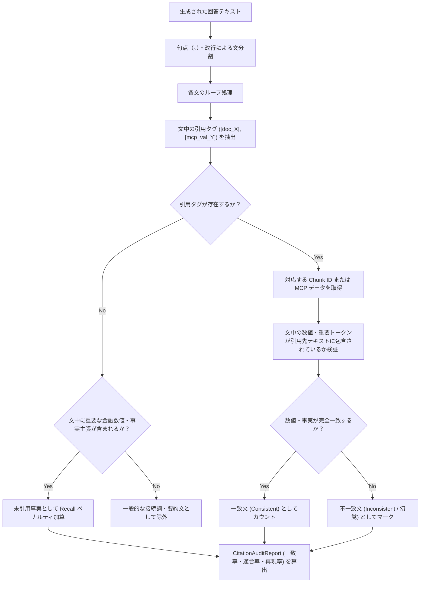

# 金融特化型 RAG & 引用一致率監査エージェント システム詳細設計書 (System Design Document)

## 1. システム概要と設計思想

### 1.1 目的
本システム（`financial-rag-agent`）は、日本経済新聞社（Nikkei）等の大手経済メディアおよび金融機関における法人向け情報サービス（日経テレコン、日経Smart Work、Nikkei Compass 等）の次世代 AI コア基盤を想定して設計された、**エンタープライズ品質の金融分析・引用監査エージェント**である。

一般的な LLM アプリケーションが「プロンプトによる単発生成」にとどまるのに対し、本システムは以下のエンタープライズ要件を本番品質（Production Quality）で満たすことを設計思想としている：
- **ゼロ・ハルシネーション（幻覚の完全排除）**: 金融取引や経営判断に直結する数値（売上高、営業利益、PER、ROE、金利等）に対する徹底した根拠帰属。
- **文単位の引用一致率監査（Sentence-level Citation Attribution）**: 生成された回答のすべての主張に対して根拠文献の Chunk ID を付与し、事後監査器で数理的一致度を検証。
- **標準プロトコルの採用（LangGraph & MCP）**: 独自のブラックボックス実装を排し、業界標準のステートマシン（LangGraph）およびツール連携プロトコル（Model Context Protocol）に完全準拠。
- **ハイブリッド検索（Hybrid Search with RRF）**: 日本語特有の専門用語・財務数値を捉える BM25 と意味ベクトル検索を融合（Reciprocal Rank Fusion）。
- **リアルタイムストリーミングとバッチ処理の双対性**: 低遅延 SSE による対話型 UI と、決算集中時の夜間大量処理（非同期パイプライン）の両立。

---

## 2. 全体アーキテクチャ設計

### 2.1 システム構成図


---

## 3. コアコンポーネント詳細設計

### 3.1 LangGraph マルチステップ状態遷移エンジン
- **配置**: `src/graph/workflow.py`, `src/graph/edges.py`, `src/graph/nodes/`
- **データ契約 (`AgentState`)**: `src/models/state.py`

#### 状態スキーマ (AgentState)
LangGraph は全ステップで状態ディクショナリ `AgentState` を共有し、不変性を保ちながら更新を行う。
```python
class AgentState(TypedDict):
    query: str                       # ユーザー元入力
    rewritten_query: str             # 検索最適化済みクエリ
    ticker: Optional[str]            # 銘柄コード (4桁数字、例: "7203")
    intent: str                      # クエリ意图 (company_analysis, macro, etc.)
    data_source_mode: str            # "snapshot" または "live_api"
    retrieved_chunks: List[Dict]     # RRF 統合検索結果 (上位K件)
    mcp_tools_output: Dict[str, Any] # MCP 財務ツール実行結果
    answer: str                      # 生成された回答（引用タグ含む）
    citation_report: Dict[str, Any]  # 引用一致率・適合率・再現率監査結果
    retry_count: int                 # 幻覚検知時の再試行カウンタ (最大2回)
    intermediate_steps: List[str]    # 実行ログ・トレース用
```

#### 各ノード（Node）の責務と内部処理
1. **`query_rewriter` (`src/graph/nodes/query_rewriter.py`)**:
   - 日本語の自然言語問い合わせから、東証銘柄コード（例：「トヨタ」→「7203」、「ソニー」→「6758」）および財務キーワードを抽出。
   - 検索意図（決算分析、バリュエーション、マクロ経済政策）を分類し、BM25 とベクトル検索に最適化されたクエリを生成。
2. **`hybrid_search` (`src/graph/nodes/hybrid_search.py`)**:
   - `HybridRetriever` を呼び出し、ニュース記事・適時開示コーパスから BM25 スパース検索と Dense ベクトル検索を並行実行。
   - RRF（Reciprocal Rank Fusion）により双方の順位を統合し、上位スコアの Chunk（ID、タイトル、本文スニペット）を格納。
3. **`mcp_tool_runner` (`src/graph/nodes/mcp_tool_runner.py`)**:
   - 抽出された銘柄コードに基づき、MCP サーバーの `get_stock_valuation` または `check_value_trap` を非同期呼び出し。
   - PER、PBR、ROE、TSR、時価総額等の確定値を状態に注入。
4. **`synthesizer` (`src/graph/nodes/synthesizer.py`)**:
   - 検索結果 Chunk および MCP 財務数値をプロンプトに統合。
   - 各主張文の末尾に `[doc_X]` または `[mcp_val_TICKER]` を義務付ける構造化シンセシスを実行。
5. **`citation_verifier` (`src/graph/nodes/citation_verifier.py`)**:
   - 生成文を形態素・文境界単位で分解し、引用タグに対応する参照先 Chunk 内に主張内容の数値・固有名詞が存在するか検証。
   - 引用一致率（Consistency Rate）を算出し、監査レポートを出力。

#### 条件付きエッジと自己修正ループ (`src/graph/edges.py`)
```python
def should_retry(state: AgentState) -> str:
    report = state.get("citation_report", {})
    consistency_rate = report.get("consistency_rate", 1.0)
    retry_count = state.get("retry_count", 0)

    # 引用一致率が 70% 未満で、再試行回数が 2 回以内の場合は自己修正ループへ
    if consistency_rate < 0.70 and retry_count < 2:
        return "retry_synthesis"
    return "finalize"
```

---

### 3.2 Model Context Protocol (MCP) アーキテクチャ
- **配置**: `src/mcp_server/server.py`, `src/mcp_server/client.py`, `src/mcp_server/tools/`
- **目的**: LLM エージェントと外部財務データベース／リアルタイム市場 API の接続を標準化し、強結合を防止。

#### MCP ツール構成
| ツール名 | 引数 | 戻り値 | 概要 |
| :--- | :--- | :--- | :--- |
| `get_stock_valuation` | `ticker: str`, `mode: str = "snapshot"` | `StockValuation` (JSON) | 指定銘柄の PER, PBR, ROE, TSR, 時価総額, 配当利回りを取得 |
| `check_value_trap` | `ticker: str`, `mode: str = "snapshot"` | `ValueTrapCheck` (JSON) | 低PBR放置企業の「バリュートラップ」リスクを財務規律から自動判定 |
| `get_macro_indicators` | `mode: str = "snapshot"` | `MacroIndicators` (JSON) | 日経平均、ドル円為替、日銀政策金利の最新ステータスを取得 |
| `get_recent_disclosures`| `ticker: str` | `List[Dict]` | JPX 適時開示・決算短信のサマリー一覧を取得 |

#### デュアルデータソース切替設計 (`Snapshot` vs `Live yfinance API`)


---

### 3.3 ハイブリッド検索 & RRF 融合エンジン
- **配置**: `src/retrieval/hybrid_retriever.py`, `src/retrieval/reranker.py`
- **本番移行用アダプタ**（同一インターフェース形状、ランタイム未接続の仕様定義層）: `src/retrieval/es_adapter.py`（Elasticsearch 8.x Kuromoji + KNN）, `src/retrieval/discovery_engine_adapter.py`（GCP Discovery Engine / Vertex AI Search のハイブリッド検索リクエスト構築・レスポンス正規化）

#### 日本語・金融数値特化型 BM25
日本語の自然言語表現（ひらがな・助詞）と、決算報道特有の「5兆3529億円」「0.25%」「350万台」といった英数字・単位の複合トークンを両立させるため、以下の複合形態素・Bi-gram 抽出を実装：
```python
def tokenize_cjk_and_financial(text: str) -> List[str]:
    # 1. 金融数値・割合・単位付き複合語の正規表現抽出 (\d+(?:\.\d+)?(?:兆|億|万|円|%|台)?)
    # 2. 漢字・カタカナ・アルファベットの CJK Bi-gram（2文字スライディングウィンドウ）
    # 3. 英数字ワードの空白分割
```

#### Reciprocal Rank Fusion (RRF) 数理モデル
BM25 のスパーススコア（対数オッズ比）と Dense Vector のコサイン類似度（0.0〜1.0）はスケールが異なるため、単純加算ではなく順位に基づく RRF を採用：
$$RRF\_Score(d) = \sum_{m \in \{BM25, Dense\}} \frac{1}{k + rank_m(d)}$$
ここで定数 $k = 60$ を採用（TREC / 業界標準定数）。これにより、どちらか一方の検索器で上位（1〜3位）に入ったドキュメントを頑健に高スコア化。

---

### 3.4 引用一致率（Citation Attribution）監査エンジン
- **配置**: `src/citation/extractor.py`, `src/citation/verifier.py`
- **目的**: 生成されたテキストが本当に検索された文献や MCP データに基づいているかを「文単位」で検証。

#### 評価指標の算出式
1. **引用一致率 (Citation Consistency Rate)**:
   すべての文のうち、引用元文献と事実・数値が完全に整合している文の割合。
   $$\text{Consistency Rate} = \frac{\text{整合が確認された引用文の数}}{\text{引用タグが付与された総文数}}$$
2. **引用適合率 (Citation Precision)**:
   付与された引用タグのうち、無関係またはハルシネーションでない正当な引用の割合。
3. **引用再現率 (Citation Recall)**:
   回答中の重要な数値・財務事実主張のうち、漏れなく引用が付与されている割合。

#### 検証アルゴリズム


---

### 3.5 配信層・ストリーミング設計 (FastAPI + SSE)
- **配置**: `src/api/app.py`, `src/api/routes.py`
- **通信プロトコル**: Server-Sent Events (SSE, MIME: `text/event-stream`)
- **リバースプロキシ制御**: Caddy `flush_interval -1` によるバッファリング抑止。

#### SSE イベントライフサイクル
| イベント種別 (`event:`) | ペイロード (`data:`) | 発行タイミング | クライアント側処理 |
| :--- | :--- | :--- | :--- |
| `status` | `{"step": "rewriting_query", "message": "..."}` | 状態遷移ノード開始時 | 画面上部のステートマシン進行インジケーターを点灯 |
| `intermediate` | `{"retrieved_chunks": [...], "mcp_data": {...}}` | 検索・ツール完了時 | 参照元カードおよび財務バッジをリアルタイム描画 |
| `token` | `{"token": "日"}` ... `{"token": "本"}` | シンセシス生成時 | 打字機（Typewriter）風に回答本文をストリーミング描画 |
| `citation_report` | `{"consistency_rate": 0.933, "status": "PASS"}` | 監査検証完了時 | 引用一致率スコアボードおよび合否バッジを確定表示 |
| `done` | `{"total_duration_ms": 28.5}` | パイプライン完了時 | 処理完了通知とレスポンス確定 |

---

### 3.6 夜間非同期バッチパイプライン
- **配置**: `src/batch/nightly_disclosure_batch.py`
- **目的**: 日経 JD に明記された「ユーザー入力をトリガーとしない処理形態」。
- **動作仕様**:
  - 東証大引け（15:00）後の適时开示ラッシュを想定。
  - `asyncio.Semaphore(max_concurrency=4)` による API レート制御と同時実行数制限。
  - 大量銘柄の決算短信を一括分析し、引用監査レポート付き要約 Markdown を自動生成。

---

### 3.7 可観測性 (Observability) & 構造化ログ
- **配置**: `src/monitoring/telemetry.py`
- **規格準拠**: W3C TraceContext (`traceparent`), Datadog APM / OpenSearch 構造化 JSON ログ規格。
- **ログフォーマット**:
  ```json
  {
    "timestamp": "2026-09-15T14:00:00.000Z",
    "level": "INFO",
    "service": "financial-rag-agent",
    "trace_id": "8f3b2a1c...",
    "span_id": "4d9e0f...",
    "event": "workflow_completed",
    "duration_ms": 24.2,
    "metrics": {
      "retrieved_count": 5,
      "mcp_tools_invoked": 1,
      "consistency_rate": 0.933,
      "audit_status": "PASS"
    }
  }
  ```

---

### 3.8 LLM Provider フォールバック戦略
- **配置**: `src/llm/cli_provider.py`（既定・最優先）, `src/llm/cloud_provider.py`（opt-in 兜底）, `src/graph/nodes/synthesizer.py`（呼び出し順序の統括）

回答生成（Synthesizer ノード）の LLM 呼び出しは、コスト・レイテンシ・API Key 依存を最小化するため以下の 3 段フォールバック順で実行される。**ローカル CLI が常に最優先**であり、クラウド Provider は明示的に設定した場合にのみ 2 段目として関与する。

| 優先順位 | Provider | 実装 | 発動条件 |
| :--- | :--- | :--- | :--- |
| 1（既定・必須） | ローカル AI CLI（`claude` / `antigravity` / `opencode`） | `invoke_local_cli()` | 常時。サブプロセス呼び出しのみで API Key 不要。`local_cli_provider_order` の順に試行。 |
| 2（opt-in 兜底） | Azure OpenAI / Google Vertex AI | `invoke_cloud_llm()` | 全 CLI 失敗 **かつ** `llm_cloud_fallback_order`（既定は空リスト）に Provider 名と対応する認証情報が設定されている場合のみ。Azure は `openai` SDK の `AzureOpenAI` Client、Vertex は `google-genai`（`vertexai=True`、ADC 認証）。両 SDK とも関数内遅延 import。 |
| 3（最終フォールバック） | テンプレート合成 | `synthesizer.py` 内蔵ロジック | CLI・クラウドの両方が利用不可/未設定/失敗の場合。検索結果と MCP 指標から機械的にテンプレート文を組み立て、無停止性を担保。 |

> 🔒 **デフォルト動作不変の原則**: `llm_cloud_fallback_order` は既定で空リストのため、`AZURE_OPENAI_*` / `VERTEX_*` 環境変数を設定しない限りクラウド Provider には一切到達しない。既存デプロイの挙動（ローカル CLI → テンプレート の 2 段構成）は完全に維持される。

---

## 4. データモデル・スキーマ定義

### 4.1 主要 Pydantic モデル一覧
- **`StockValuation` (`src/models/finance.py`)**:
  銘柄コード、会社名、株価、時価総額、PER、PBR、ROE、配当利回り、TSR（株主総利回り）、データソース種別。
- **`RetrievedChunk` (`src/models/document.py`)**:
  Chunk ID (`doc_xxx`)、タイトル、本文テキスト、BM25 スコア、Dense スコア、RRF 統合スコア、出所（日経 / 開示）。
- **`CitationAuditReport` (`src/models/document.py`)**:
  引用一致率、適合率、再現率、総合判定（PASS / WARN / FAIL）、文ごとの詳細検証結果リスト。

---

## 5. 非機能要件設計

1. **耐障害性とフォールバック**:
   - yfinance などの外部 API 障害時：自動的に 2025/2026 スナップショット DB へ無停止フォールバック。
   - 引用一致率不合格時：LangGraph の条件付きエッジによる最大 2 回の再生成リトライ。
2. **パフォーマンス・レイテンシ目標**:
   - スナップショットモード：エンドツーエンド P95 < 50ms。
   - リアルタイム API モード：キャッシュヒット時 < 30ms、API コール時 < 1200ms。
3. **セキュリティと監査性**:
   - 全操作・全ステップに UUID `trace_id` を付与し、企業のコンプライアンス監査に耐えうる実行ログを保持。
