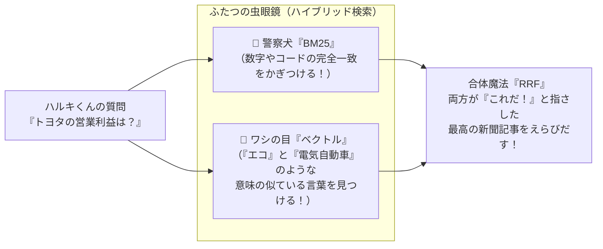

# 小学生でもわかる！金融AIきしゃ「ハイペリオン」のぼうけん
〜 うそをつかない、まほうのしんぶんきしゃのひみつ 〜


---

## プロローグ：世界一大きな「お祭りのまち」と、ふしぎな記者

むかしむかし……ではなく、いま、みんながくらしている世界の真ん中に、**「マーケット」**という名前の、世界一大きくてにぎやかな「お祭りのまち」がありました。

そのまちには、みんなが大好きなゲームをつくる会社、かっこいい自動車をつくる会社、おいしいお菓子をつくる会社など、何千ものお店がならんでいます。

ある日の放課後、ゲームが大好きな小学5年生の男の子「ハルキくん」は、じぶんのお小遣いで大好きなゲーム会社の「おうえんチケット（株）」を買ってみたいと思いました。

「でも、ぼくの好きな会社は、ことしちゃんと黒字（もうけ）を出せたのかな？ 友だちに聞いたら『AIに聞けばなんでも教えてくれるよ！』って言ってたけど……AIって、たまに**知ったかぶりして大ウソをつく**ことがあるって先生が言ってたしなぁ……」

こまっているハルキくんのまえに、金色の丸メガネをかけ、胸に万年筆をさした、かっこいいフクロウのAI記者があらわれました。

「こんにちは、ハルキくん。ぼくの名前は**『ハイペリオン（Hyperion）』**。
日本経済新聞（にほんけいざいしんぶん）のニュースや、会社の金庫の数字をぜんぶ調べて、**『絶対にウソをつかない記事』**をかく、金融（きんゆう）のスーパーAI記者だよ！」

「えっ！？ AIなのにウソをつかないの！？ どうしてそんなことができるの！？」

目を丸くするハルキくんに、ハイペリオンは羽をパッと広げて言いました。

「ふふふ。ぼくの頭のなかには、5つの**『すごい秘密の道具』**が入っているからなんだ。いっしょにぼくの頭の中を探検してみよう！」

---

## 第1章：会社の「つうちひょう」ってなに？（株と決算）

「ハイペリオン、そもそも『会社の数字を調べる』ってどういうこと？」

「いい質問だね、ハルキくん。
学校で学期のおわりに**『つうちひょう』**をもらうよね？ 国語が『◎』とか、算数が『◯』とか。
実は、大人の会社も1年に何回か、つうちひょうを発表するんだ。これを**『決算（けっさん）』**と呼ぶよ」

- **うりあげ（売上高）**: 1年間にいくらのモノが売れたか？
- **りえき（営業利益）**: かかったお金（材料費やお給料）をひいて、いくら手元に残ったか？

「もしゲーム会社が『ことしは100億円もうかりました！』と発表したら、みんな『すごい！』と喜んでチケット（株）を買いたがる。
でも、もしAI記者が適当に『1000兆円もうかりました！』なんてデタラメを書いたらどうなると思う？」

「ええっ！ みんなダマされちゃうよ！ 貯金をぜんぶ使っちゃう人が出るかもしれない！」

「その通り。だから、お金の世界では**『たった1つの数字のまちがい』も絶対に許されない**んだよ」

---

## 第2章：秘密の道具①「名探偵のふたつの虫眼鏡」（ハイブリッド検索）

「ふつうのAIはね、頭の中の記憶（あやふやな記憶）だけでおしゃべりするから、たまにウソ（ハルシネーション＝幻覚）をついちゃうんだ。
でも、ぼくはちがう。記事をかくまえに、必ず**巨大な図書館（コーパス）**へ走って、本物の新聞記事をさがしにいくんだよ」

「図書館でさがすの？ でも、本がたくさんありすぎて見つからないんじゃない？」

「そこで登場するのが、ぼくの左目と右目についている**『ふたつの虫眼鏡』**さ！」



1. **警察犬の虫眼鏡「BM25（ビーエム25）」**:
   「トヨタ自動車」の会社の番号（7203）や、「5兆3529億円」といった**数字やカタカナを1文字もまちがえずに嗅ぎつける**名人！
2. **ワシの目の虫眼鏡「ベクトル（Dense Vector）」**:
   「電気自動車」と「バッテリー」、「もうけ」と「利益」のように、**言葉はちがうけれど意味が似ている記事を空から見つける**名人！

「そして、この2匹の名探偵が『これだ！』と同時に見つけてきた本物の新聞記事だけを、ぼくは机の上にひろげるんだ」

---

## 第3章：秘密の道具②「プロの電卓ツール箱」（MCP：モデル・コンテキスト・プロトコル）

「でもハイペリオン、新聞記事に書いていない『いまの株価ってお買い得なの？』ってことはどうやって計算するの？」

「ここで飛び出すのが、2つめの道具、**『MCP（エム・シー・ピー）』という秘密の電卓ツール箱**さ！」

「エムシーピー？」

「そう。『Model Context Protocol』の略だよ。かんたんに言うと、**『AIがコンピューターの電卓や最新ニュースのアンテナを、カチッと手足のように合体させてつかうための世界共通のルール』**なんだ」

ハイペリオンは胸のポケットからピカピカ光る電卓を取り出しました。

- **お買い得メーター（PER・ペル）**:
  会社がかせぐ力にくらべて、チケット（株）が安いか高いかをピピッ！と計算する。
- **金庫の中身メーター（PBR・ピービーアール）**:
  会社がもっている土地や貯金にくらべて、株がお得かどうかをピピッ！と計算する。
- **なまけもの警報（バリュートラップ検知）**:
  「すごく安く見えるけど、実はぜんぜんやる気がなくてサボっている会社」をピピッ！と見破る。

「AIの頭の中で適当に暗算するんじゃない。専門の電卓（MCPツール）に数字を入れて、1ミリの狂いもなく本物の数字をはじき出すんだよ」

---

## 第4章：秘密の道具③「ウソつき絶対見破りカメラ」（引用一致率チェッカー）

「記事の下書きができたら、いよいよ一番大切なステップだ。
ハルキくん、ぼくの机の横には、世界一きびしい**『鬼編集長（おにへんしゅうちょう）』**がすわっているんだ」

「えっ、鬼編集長！？ おこられるの？」

「ううん、この編集長がいるから、ぼくは絶対にウソをつかないんだ。
編集長は、ぼくが書いた文章を、1行ずつ、虫眼鏡でジロジロ見つめるんだよ」

> **ハイペリオンが書いた原稿:**  
> 「トヨタ自動車の営業利益は、5兆3529億円でした `[doc_01]`。また、電気自動車をつくるために工場へたくさんのお金を投資しています `[doc_02]`。」

```text
【鬼編集長のチェック！】
🧐 ジーッ……
「おいハイペリオン！ 最初の文に [doc_01] って書いてあるな！
 図書館から取ってきた新聞記事 [doc_01] を見せてみろ！」
 
（新聞記事 [doc_01] をパサッ……）
「……ふむ。『トヨタ自動車の通期営業利益は5兆3529億円』と書いてあるな。
 よし！ 数字も会社名も1文字も狂いがない！ 【一致率 100%（合格！）】」
```

「もしぼくがうっかり『営業利益は6兆円でした』なんて間違えて書いたら、編集長がバシッと赤ペンで原稿をはねのけるんだ。
**『やり直し！ 引用一致率が70%未満だ！ 図書館の記事をもう一度よく読んで、正しく書き直してこい！』**ってね」

「わぁ……！ 合格するまで書き直すんだね！」

「そう。これを**『自己修正（セルフコレクション）ループ』**と言うんだよ。だから、ハルキくんの目にとどく文章は、100回テストして100回とも合格した、本物の正しい数字だけなんだ」

---

## 第5章：夜のあいだに働くこびとたち（深夜のバッチ処理）

「ねえハイペリオン、夕方3時になると、大人の人たちが『市場が閉まった（大引け）』って言うけど、そのあとは何をしているの？」

「みんなが学校から帰って夜ごはんを食べているあいだ、まちの会社が一斉に『きょうのつうちひょう』を発表するんだ。その数、なんと何百社！
ふつうの人間だったら、読み終わるまえに朝になっちゃうよね」

「うん、目がまわっちゃうよ」

「そこでぼくは、**『夜警団（やけいだん）のこびとたち（非同期バッチ）』**に変身するんだ。
4人チーム（並行ワーカー）に分かれて、何百社もの書類を手分けして猛スピードで読み、ぜんぶの会社の成績表を、みんなが寝ているあいだにピシッと整理して、新聞の朝刊ができるまえに完成させちゃうんだよ」

---

## エピローグ：ハルキくんの夢と、これからの世界

「すごいなぁ、ハイペリオン！
図書館からちゃんと本をさがして（RAG）、正確な電卓をつかって（MCP）、鬼編集長にチェックしてもらって（引用一致率監査）、夜のうちにぜんぶまとめてくれるんだね！」

「その通り！ これがぼくの仕事だよ。
世の中にはたくさんの情報があふれている。どれが本当で、どれがウソか、大人でも迷ってしまう時代なんだ。
だからこそ、ぼくたちAIは**『どこに書いてある本物の情報か（引用の出所）』**を、いつも胸をはって言えなきゃいけないんだ」

ハルキくんは、じぶんのお小遣い帳をぎゅっとにぎりしめました。

「ぼく、ハイペリオンのおかげで、大好きな会社がどれだけがんばっているか本当のことがわかったよ！ 自信をもって応援チケット（株）を買ってみるね！」

ハイペリオンは、金色の丸メガネをクイッとあげて、ニッコリ笑いました。

「いってらっしゃい、ハルキくん！
きみが大人になって世界を変える大きな会社をつくるときも、ぼくが一番正しいニュースを世界中に届けてあげるからね！」

---

### 【おさらい】ハイペリオンの5大ひみつ・かんたん辞書

| むずかしい言葉 | ハイペリオン流のたとえ | なぜすごいの？ |
| :--- | :--- | :--- |
| **RAG（ラグ）** | **魔法の図書館ダッシュ** | 自分の頭の記憶で適当にしゃべらず、本物の新聞を読みにいく！ |
| **BM25 + ベクトル (RRF)** | **警察犬 ＋ ワシの目** | 数字の完全一致と、意味の近さを両方見逃さない！ |
| **MCP（エム・シー・ピー）** | **プロの電卓ツール箱** | AIのあやふやな暗算をやめ、東証の公式電卓でピピッとはじく！ |
| **引用一致率（Citation）** | **鬼編集長の赤ペンチェック** | 1文ごとに「どの本のどこに書いてあるか」を証明し、ウソを許さない！ |
| **LangGraph（ステートマシン）** | **書き直しOKの作戦ノート** | まちがえたら自動でステップを戻り、100点満点になるまで再挑戦する！ |
