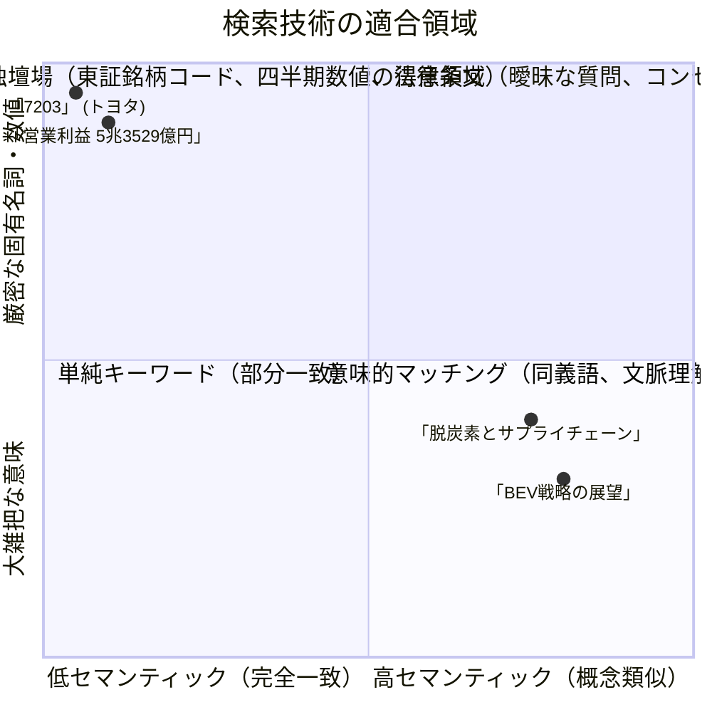

# 金融特化型 RAG & 引用一致率監査エージェント 前提基礎知識ガイド (Fundamental Knowledge & Concepts Guide)

## 1. はじめに

本システム（`financial-rag-agent`）は、**最先端の生成 AI / LLM オーケストレーション技術**と**厳密な金融・財務工学のドメイン知識**が交差する領域に位置しています。

本書は、本システムの設計意図、ソースコードの内部構造、および評価指標を深く理解し、保守・拡張・評価を行うために必要な前提基礎知識を体系的に解説したエンジニア向け知識ベースです。

---

## 2. 金融×LLM システムにおける固有の課題

### 2.1 なぜ「一般的な RAG」は金融実務で破綻するのか？
一般的なチャットボットや社内文書 RAG では、「なんとなくそれらしい回答」が得られれば及第点とされることが少なくありません。しかし、**経済メディア（日経新聞等）の読者や金融機関のディーラー、ファンドマネージャー、経営企画部門**を対象とするサービスでは、小さな誤謬が重大な誤認や投資損失、コンプライアンス違反に直結します。

| 課題項目 | 一般的な RAG の挙動 | 金融実務で求められる厳密性 | 本システムのアプローチ |
| :--- | :--- | :--- | :--- |
| **数値の厳密性** | 「約5兆円」「大幅な増益」など大雑把に要約 | 「5兆3529億円」（1円単位、100万円単位の正確性） | CJK数値特化トークナイズ + BM25 で厳格に数値を照合 |
| **会計期間の識別** | 2023年3月期と2024年3月期、通期と四半期を混同 | 会計年度（FY）、第Q（四半期）、本決算の完全な区別 | メタデータフィルタリング + 意図分類による Query Rewrite |
| **根拠の透明性** | 「一般的な情報によれば…」と出所が曖昧 | 記事ID、開示日時、発表元の完全なトレーサビリティ | すべての主張文に対する `[doc_X]` 引用付与と一致率監査 |
| **ハルシネーション** | 自信満々に架空の数値を創作（10〜20%混入） | 許容誤差 0%（ゼロ・ハルシネーション原則） | 引用監査不合格時の自己修正（Self-Correction）ループ |

---

## 3. エージェントオーケストレーション技術の基礎

### 3.1 従来の Linear Chain と LangGraph（有向グラフ）の相違
初期の LLM アプリケーション（LangChain の旧 Chain やシンプルなパイプライン）は、直列的（A → B → C）な処理しか行えませんでした。

しかし、実用的なエージェントには以下の要件が不可欠です：
1. **循環（Cycles）**: 監査や評価に落ちた場合、前のステップに戻ってやり直す。
2. **分岐（Branching）**: クエリが個別企業分析か、マクロ経済かによって呼び出すツールを動的に切り替える。
3. **状態管理（State Management）**: 単一の信頼できる情報源（Single Source of Truth）として状態辞書を更新・引き継ぐ。
4. **中断と再開（Checkpoints & Human-in-the-loop）**: 状態を外部永続化し、エラー発生時の巻き戻しや人間の承認を挟む。

本システムが採用する **LangGraph** は、ステートマシン（有向グラフ）としてエージェントの振る舞いを数学的にモデル化します。

```text
従来のパイプライン:
  [入力] ──> [検索] ──> [生成] ──> [出力]  (誤りがあっても止まらない)

LangGraph 状態マシン (本システム):
  [入力] ──> [クエリ改写] ──> [検索] ──> [MCPツール実行]
                                  ▲              │
                                  │              ▼
                            [自己修正ループ] <─ [回答生成]
                                  │              │
                                  │              ▼
                              (合否判定) <── [引用一致率監査]
                                  │
                                  └── PASS ──> [ストリーミング出力 & 永続化]
```

---

## 4. Model Context Protocol (MCP) の基礎

### 4.1 MCP とは何か？
**Model Context Protocol (MCP)** は、AI アプリケーションと外部ツール／データソース間の通信を標準化するために Anthropic 社が提唱し、急速に業界標準となりつつあるオープンプロトコルです。

### 4.2 なぜ REST API 直接呼び出しではなく MCP なのか？
1. **疎結合性と再利用性**:
   財務指標の計算ロジック（PER、PBR、バリュートラップ検出等）を独立した MCP サーバーとして分離することで、CLI、Web UI、LangGraph エージェント、外部システムから同一のツール定義を共有可能。
2. **コンテキストの自律的発見**:
   LLM は MCP の提供する JSON Schema 仕様に基づき、どのようなツールが存在し、どの引数を渡すべきかをプロンプト外から標準化された手段で取得・実行。
3. **セキュリティと境界防御**:
   LLM エージェントにデータベースへの直接アクセス権や環境変数を与えず、MCP サーバーの境界越しに安全に処理を実行。

---

## 5. 金融ドメイン向け検索技術（Information Retrieval）

### 5.1 スパース検索（BM25） vs デンス検索（Dense Vector）
RAG の検索層において、どちらか一方だけでは金融ドメインの要求を満たせません。



- **スパース検索 (BM25 Okapi)**:
  - 単語の出現頻度（TF）と逆文書頻度（IDF）に基づく統計的スコアリング。
  - **強み**: 銘柄コード「7203」や財務数値「5兆3529億円」など、1文字のブレも許されない完全一致キーワードを確実に上位へ引き上げる。
- **デンス検索 (Dense Vector Embedding)**:
  - 文章全体を高次元ベクトル空間（本システムでは 384 次元）に写像し、コサイン類似度で近傍探索。
  - **強み**: 「電動化の行方」という質問に対して、「BEV投資」「電池工場新設」といった同義語・関連語を含む記事をヒットさせる。

### 5.2 Reciprocal Rank Fusion (RRF) のメカニズム
BM25 のスコアは $[0, \infty)$ の対数オッズ比であり、Dense Vector のコサイン類似度は $[-1, 1]$ です。これらを単純加算すると、特定の検索器のスコアの振れ幅に結果が引きずられてしまいます。

**RRF（Reciprocal Rank Fusion）** は、スコアの値そのものではなく「検索結果における順位（Rank）」のみを用いて統合します：
$$RRF(d) = \sum_{m \in M} \frac{1}{k + r_m(d)}$$
- $M$: 検索手法の集合（$\{\text{BM25}, \text{Dense}\}$）
- $r_m(d)$: 手法 $m$ における文書 $d$ の順位（1位なら 1）
- $k$: 平滑化定数（標準推奨値: 60）

これにより、片方の検索器で圧倒的 1 位、もう片方で 10 位といった文書が、双方で中途半端な 8 位にある文書よりも確実に上位にランク付けされます。

---

## 6. 引用帰属（Citation Attribution）と評価指標（Eval）

### 6.1 引用一致率（Consistency Rate）の算出理論
日経新聞社等の採用基準で最も重視されるのが、「引用の精度をどう定義し、どう自動測定するか」です。本システムでは以下の 3 つの数学的指標を厳格に定めています。

1. **引用一致率（Citation Consistency Rate）**:
   モデルが引用タグ（`[doc_X]`）を付与した各文について、その文中に含まれる重要トークン（数値、社名、動詞）の集合 $T_{sent}$ と、参照先 Chunk のトークン集合 $T_{chunk}$ の共通集合を評価：
   $$\text{Consistency} = \frac{|\{s \in \text{Sentences}_{\text{cited}} \mid \text{Support}(s, \text{Chunk}(s)) \ge \tau\}|}{|\text{Sentences}_{\text{cited}}|}$$
   （※ $\tau$ は閾値。本システムでは 0.70 を採用）

2. **引用適合率（Citation Precision）**:
   付与された引用のうち、実際にその文の主張を裏付けている正当な引用の割合（無関係な文献を適当に引用する「見せかけ引用」を排除）。

3. **引用再現率（Citation Recall）**:
   回答文の中に存在するすべての客観的事実・数値のうち、漏れなく引用が付与されている割合（引用なしで数値を語る「未根拠記述」を検出）。

---

## 7. 日本の金融実務・財務指標の基礎知識

本システムの MCP サーバー（`src/mcp_server/tools/valuation_tools.py`）で計算・提供される指標の定義です。

### 7.1 PER（Price Earnings Ratio: 株価収益率）
$$\text{PER} = \frac{\text{株価}}{\text{1株当たり当期純利益 (EPS)}} = \frac{\text{時価総額}}{\text{当期純利益}}$$
- **意味**: 企業の純利益に対して株価が何倍まで買われているかを示す指標。
- **日本市場の目安**: 東証プライム平均は約 15〜16倍。一般に 10倍以下は割安、25倍以上は成長期待（グロース株）とされる。

### 7.2 PBR（Price Book-value Ratio: 株価純資産倍率）
$$\text{PBR} = \frac{\text{株価}}{\text{1株当たり純資産 (BPS)}} = \frac{\text{時価総額}}{\text{純資産}}$$
- **意味**: 会社が解散した場合に株主に残る資産（解散価値）に対する株価の倍率。
- **東証の「PBR 1倍割れ是正要請」**:
  2023年春以降、東京証券取引所は上場企業に対し「資本コストや株価を意識した経営の実現」を強く要請。PBR 1倍割れの企業は「解散価値すら下回る資本効率の悪い企業」と見なされ、自己株式取得（自社株買い）や増配、事業ポートフォリオ見直しが強く求められている。

### 7.3 ROE（Return on Equity: 自己資本利益率）
$$\text{ROE} = \frac{\text{当期純利益}}{\text{自己資本（純資産）}} \times 100 \; (\%)$$
- **意味**: 株主から預かった資本を使ってどれだけ効率的に利益を上げたかを示す指標。
- **伊藤レポート基準**: 日本企業において国際的投資家を惹きつけるための最低目標ラインとして「ROE 8%以上」が定着している。

### 7.4 TSR（Total Shareholder Return: 株主総利回り）
$$\text{TSR} = \frac{(\text{期末株価} - \text{期首株価}) + \text{期間中の配当金}}{\text{期首株価}} \times 100 \; (\%)$$
- **意味**: キャピタルゲイン（値上がり益）とインカムゲイン（配当金）を合算した、投資家が実際に得たトータルリターン。

### 7.5 バリュートラップ（Value Trap: 割安の罠）の検知ロジック
- **現象**: 「PBRが0.6倍で一見超割安に見えるが、何年経っても株価が上がらない」銘柄。
- **要因**: ROE が極めて低い（資本が遊休化）、内部留保を溜め込んで株主還元しない、売上高が構造的衰退局面にある。
- **本システムの判定基準**:
  - `PBR < 0.8倍` かつ `ROE < 5.0%` の場合、単なる「割安（Undervalued）」ではなく「**バリュートラップ懸念（Value Trap Risk）**」として判定・警告を出力。
