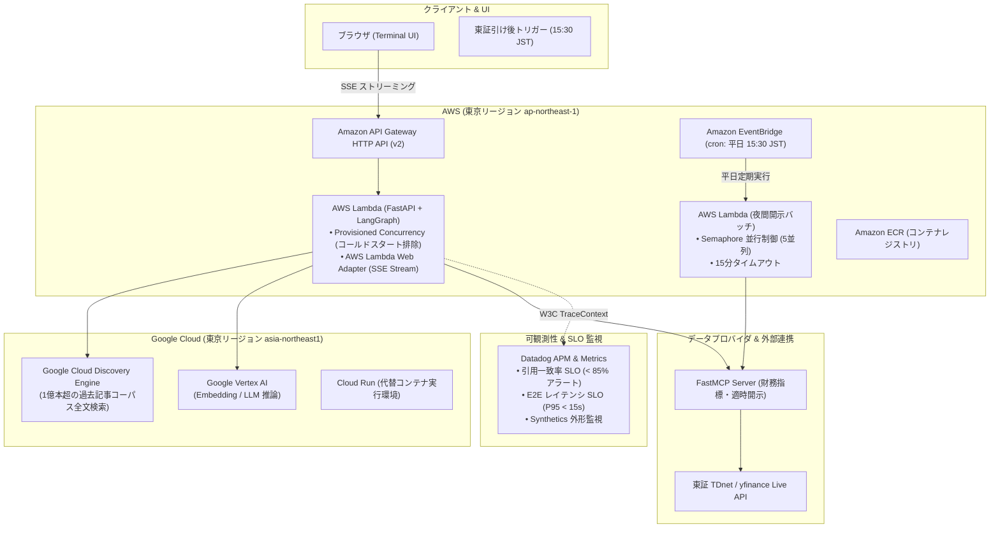

# Cloud-Native Infrastructure & IaC (日経本番運用アーキテクチャ)

本ディレクトリは、日本経済新聞社の BtoB デジタル情報サービス（日経リスク＆コンプライアンス、NIKKEI The KNOWLEDGE、NIKKEI KAI）の運用制約を満たす、**マルチクラウド（AWS + GCP）およびサーバーレス IaC 構成**を定義します。

---

## 1. システム全体構成図 (Multi-Cloud Architecture)



---

## 2. 本番運用制約への技術的対策 (Production Constraints)

### ① コールドスタート排除と応答 SLO
- **課題**: サーバーレス環境（Lambda / Cloud Run）におけるコンテナ起動時（Python ランタイム + 依存パッケージ）の初期遅延（3〜6秒）が、リアルタイム金融アナリストツールの SLO（初回レスポンス < 1.0秒）を毀損する。
- **対策**:
  - `aws_lambda_provisioned_concurrency_config` により常時 5 インスタンスを事前プロビジョニング。
  - Docker マルチステージビルド（`python:3.12-slim` + `uv`）でイメージサイズを最小化。
  - AWS Lambda Web Adapter（LWA）を採用し、FastAPI の SSE `StreamingResponse` をチャンク変換オーバーヘッドなしでネイティブ直接透過。

### ② 同時実行上限とコスト・レートリミット制御
- **課題**: 多数のユーザーが一斉にマルチステップエージェントを実行すると、LLM バックエンドの Quota 上限（TPM / RPM）に到達し、429 Too Many Requests が発生する。
- **対策**:
  - `reserved_concurrent_executions = 50` により、同時実行枠を明示的に予約・制限。
  - 夜間バッチ（`src/batch/nightly_disclosure_batch.py`）では `asyncio.Semaphore(5)` により東証銘柄の並行処理レートを自動調整。

### ③ 非同期バッチ生成基盤 (EventBridge 定期実行)
- **特徴**: ユーザー入力をトリガーとせず、平日 15:30 JST（東証大引け・適時開示集中時間）に EventBridge が `nikkei-disclosure-nightly-batch` を自動発火。大量の適時開示からサマリーレポートを自律生成し、監査済み引用付きで蓄積。

### ④ 品質保証と Datadog APM 連携
- **引用一致率 SLO**: 一致率が 85% を下回った場合に Datadog Monitor が発火。
- **レイテンシ監視**: P95 レイテンシが 15 秒を超過した場合にアラート通知。
- **W3C 分散トレーシング**: リクエストヘッダー `traceparent` を伝播し、FastAPI → LangGraph 节点 → MCP Server 間のレイテンシ内訳を完全に可視化。

---

## 3. デプロイ手順

### Terraform の適用
```bash
cd infra/terraform
terraform init
terraform plan
terraform apply
```

### Docker Compose によるローカル本番シミュレーション
```bash
cd infra/docker
docker compose up --build
```
- Web UI / API: `http://localhost:8000`
- Elasticsearch (Kuromoji 8.13): `http://localhost:9200`
- FastMCP Server: `http://localhost:8001`
